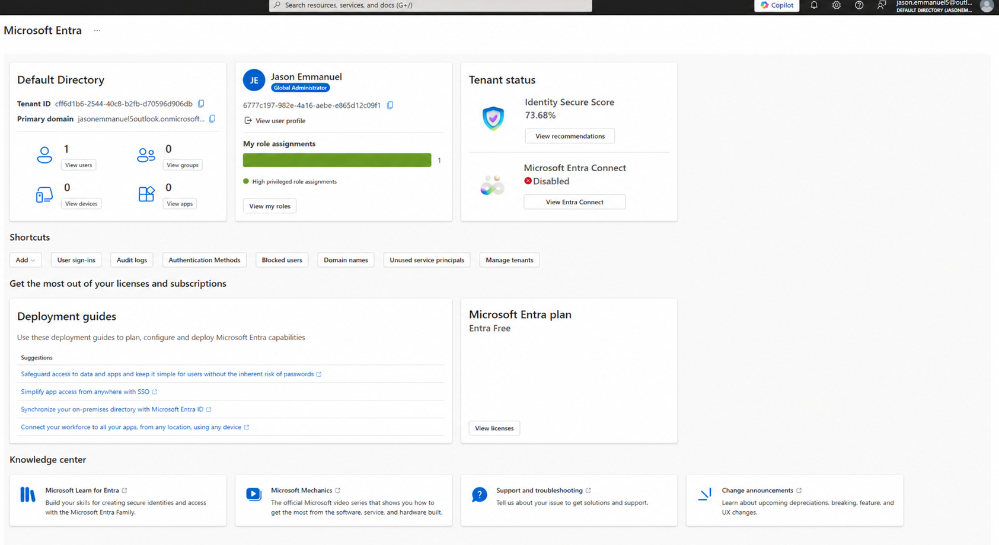
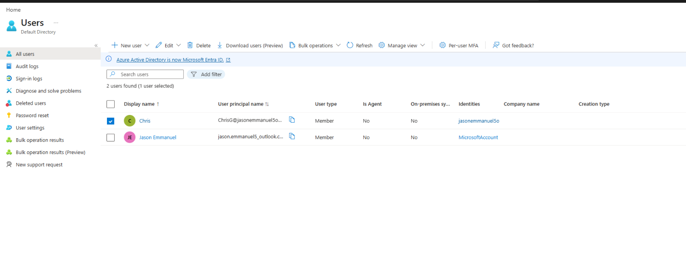
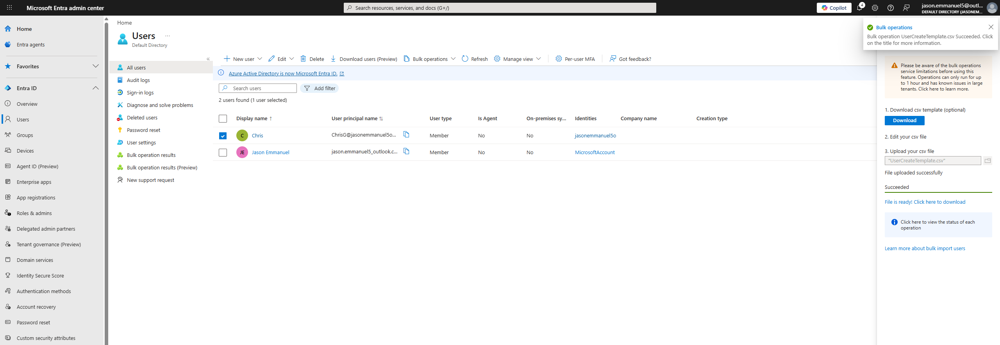
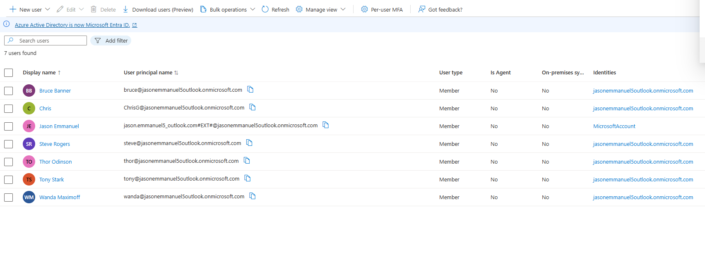
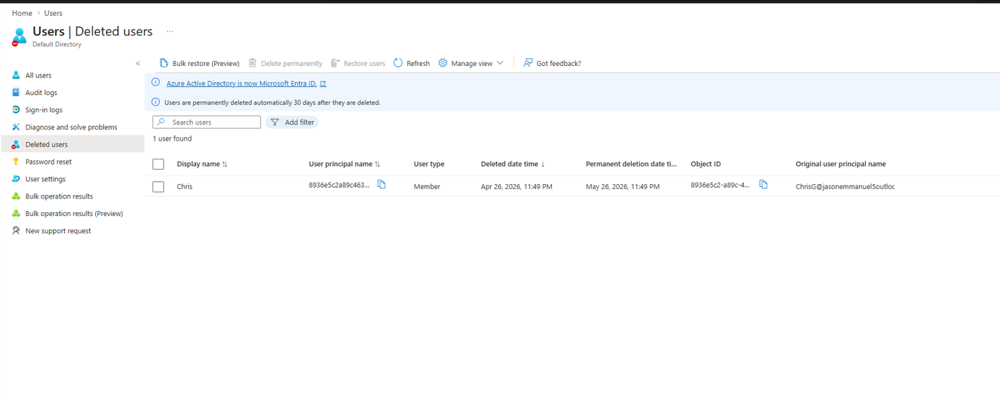
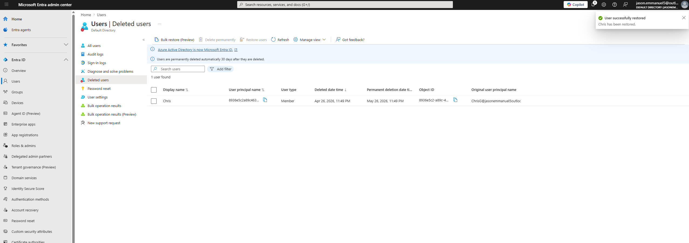
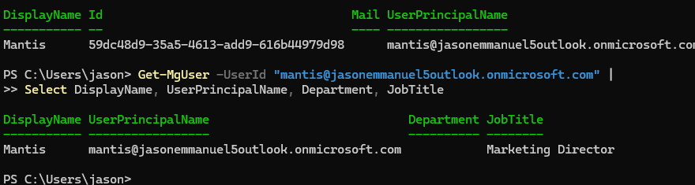
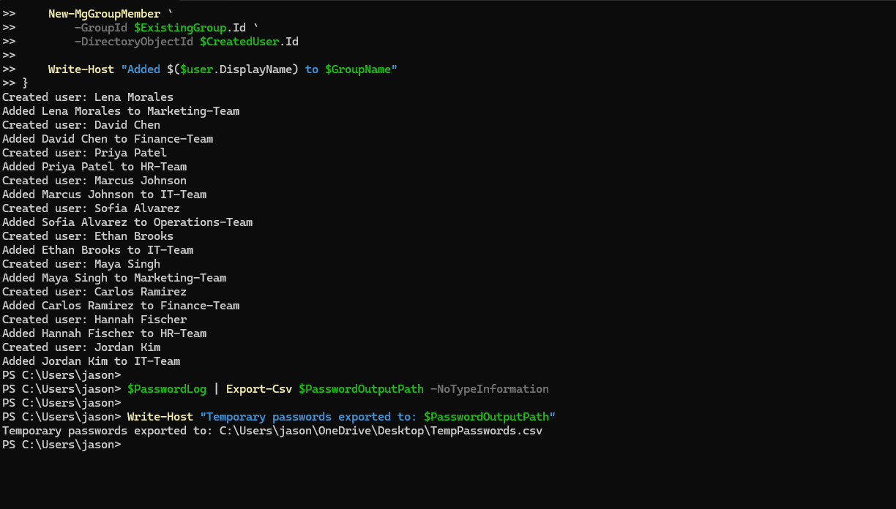

# Project – Azure Environment Setup & User Role Management in Microsoft Entra ID

---

## Overview

This project demonstrates foundational **Identity and Access Management (IAM)** administration tasks performed in **Microsoft Entra ID**.

The lab simulates real-world identity administrator responsibilities including:

- user provisioning
- role assignment and removal
- least privilege validation
- bulk user onboarding
- account deletion and restoration
- Microsoft Graph PowerShell automation

This mirrors daily responsibilities of an **IAM Analyst / Identity Administrator** supporting cloud identity platforms.

---

## Environment

| Tool | Purpose |
|------|---------|
| Microsoft Entra ID | Cloud directory platform |
| Azure Portal | Tenant setup |
| Microsoft Entra Admin Center | User lifecycle management |
| Microsoft Graph PowerShell SDK | Identity automation |
| PowerShell 7.2+ | Script execution |
| GitHub | Documentation + evidence tracking |

---

## Tenant Identity Environment

All testing was performed inside a dedicated Microsoft Entra ID tenant using least-privilege administrative workflows.

User provisioning methods demonstrated:

- Manual provisioning (GUI)
- Bulk provisioning (CSV)
- Automated provisioning (PowerShell)

*Microsoft Entra ID tenant directory initialized with test identity available for RBAC validation*

---

## RBAC Role Assignment Validation Scenario

### User: Chris Green

**Scenario**

A standard user account was created and tested before and after directory role assignment to validate RBAC enforcement behavior.

**Actions Performed**

1. Created user account
2. Verified default permissions as Member user
3. Assigned **Application Administrator** role
4. Confirmed elevated access capability
5. Removed privileged role after validation

**Principle Applied**

Least privilege enforcement — privileged directory roles should only exist when required.

*Chris Green provisioned as standard directory user*

---

## Bulk User Provisioning Scenario

**Scenario**

Multiple users were imported using Microsoft Entra ID CSV bulk provisioning.

This simulates enterprise onboarding workflows during:

- hiring waves
- migrations
- department launches
- identity synchronization staging

**Actions Performed**

1. Downloaded CSV provisioning template
2. Populated user attributes
3. Uploaded provisioning file
4. Verified successful creation
5. Confirmed users visible in directory

*Bulk provisioning operation completed successfully*

*Directory populated with imported users after CSV bulk provisioning*

---

## User Lifecycle Recovery Scenario

### Delete + Restore Workflow

**Scenario**

A user account was deleted and restored to validate Microsoft Entra soft-delete lifecycle handling.

**Actions Performed**

1. Deleted Chris Green account
2. Navigated to Deleted Users container
3. Located deleted identity object
4. Restored account
5. Confirmed directory reappearance

**Security Principle Applied**

Soft-delete protects against accidental account removal and preserves audit integrity.

*Chris Green located inside Deleted Users container*

*Account successfully restored to active directory*

---

## PowerShell Identity Attribute Validation Scenario

### Scenario

Microsoft Graph PowerShell was used to validate identity attributes assigned during provisioning for a test account.

This simulates real-world identity administrator verification workflows used to confirm user attribute accuracy after automated provisioning.

### Actions Taken

1. Connected to Microsoft Graph using delegated permissions
2. Queried the user object using Get-MgUser
3. Retrieved identity attributes from Microsoft Entra ID
4. Verified department and job title values populated correctly

### Attributes Confirmed

- Display Name
- User Principal Name
- Department
- Job Title

### Principle Applied

Identity attribute validation ensures provisioning accuracy and supports audit readiness during onboarding automation workflows.

*PowerShell output confirming successful identity attribute configuration*

---

## PowerShell Automated User Provisioning Workflow

### Scenario

Multiple identities were provisioned using Microsoft Graph PowerShell and automatically assigned to department-aligned security groups.

This simulates enterprise onboarding automation where identity administrators provision users programmatically instead of through manual portal workflows.

### Actions Taken

1. Created multiple user accounts via Microsoft Graph PowerShell
2. Assigned department attributes
3. Added users to role-aligned security groups
4. Exported temporary passwords for controlled credential distribution

### Users Provisioned

| User | Department Team |
|------|----------------|
| Lena Morales | Marketing-Team |
| David Chen | Finance-Team |
| Priya Patel | HR-Team |
| Marcus Johnson | IT-Team |
| Sofia Alvarez | Operations-Team |
| Ethan Brooks | IT-Team |
| Maya Singh | Marketing-Team |
| Carlos Ramirez | Finance-Team |
| Hannah Fischer | HR-Team |
| Jordan Kim | IT-Team |

### Principle Applied

Automated provisioning reduces manual administrative effort, improves consistency, and supports scalable identity lifecycle management aligned with least privilege access models.

*PowerShell script provisioning multiple identities and assigning group membership*

---

## Skills Demonstrated

| Skill | How It Was Applied |
|------|--------------------|
| User Provisioning | Created users manually and via Microsoft Graph PowerShell |
| RBAC Enforcement | Assigned and removed directory roles during validation testing |
| Least Privilege | Temporary elevation followed by role removal |
| Bulk Identity Creation | CSV-based provisioning workflow |
| Lifecycle Recovery | Deleted and restored user accounts |
| Identity Automation | Scripted multi-user provisioning with group assignment |
| Attribute Validation | Verified Department and JobTitle attributes using Graph PowerShell |
| Evidence Documentation | Captured screenshots supporting each identity lifecycle step |

---

## Lessons Learned

**Directory roles control administrative capability boundaries.**  
Testing Application Administrator assignment demonstrated how quickly privilege elevation changes identity management capabilities inside Microsoft Entra ID.

**Bulk provisioning improves onboarding scalability.**  
CSV-based provisioning enables rapid identity creation during hiring waves and migrations while maintaining attribute consistency.

**Soft-delete protects directory integrity.**  
Restoring Chris Green validated Microsoft Entra ID lifecycle safeguards that preserve audit history before permanent deletion.

**PowerShell enables enterprise-ready identity automation.**  
Microsoft Graph scripting supports repeatable provisioning workflows aligned with modern IAM operational practices.

---

## References

- Microsoft Entra ID Documentation  
https://learn.microsoft.com/en-us/entra/identity/

- Assign Microsoft Entra roles  
https://learn.microsoft.com/en-us/entra/identity/role-based-access-control/manage-roles-portal

- Microsoft Graph PowerShell  
https://learn.microsoft.com/en-us/powershell/microsoftgraph/

- SC-300 Lab: Manage User Roles  
https://microsoftlearning.github.io/SC-300-Identity-and-Access-Administrator/Instructions/Labs/Lab_01_ManageUserRoles.html
